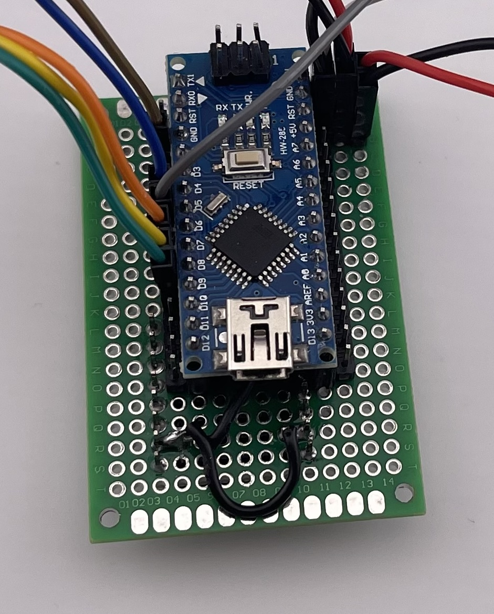

The Basketball Desktop Arcade Game assembles with a combination of press-fits, glue, and of course soldering for the electronics. 

## 3D-Printed Components
| Item                      | Quantity |
| ------------------------- | -------- |
| Case                      | 1        |
| Netting Panels            | 2        |
| Rear Legs                 | 2        |
| Front Legs                | 2        |
| Front Panel               | 1        |
| Start Button              | 1        |
| Start Text Panel          | 1        |
| Case Bottom Panel         | 1        |
| Side Panels               | 2        |
| Front Side Rails          | 2        |
| Rear Court Bracket        | 1        |
| Front Court Bracket       | 1        |
| Court                     | 1        |
| Back Board                | 1        |
| Hoop                      | 1        |
| Ball Blocker              | 1        |
| Ball Halfs                | 12       |
| Ball Alignment Pegs       | 6        |
| Hoop & Net                | 1        |
| Hoop Bracket              | 1        |
| Launcher                  | 1        |
| Launcher Pivot            | 1        |
| Launcher Swivel Connector | 1        |
| LED Bracket               | 1        |
| Power Board Bracket       | 1        |
## Electronic Components
Here is the list of components I used in creating the game along with links to Amazon to see the specific versions I used. Assuming compatible dimensions you can swap out components as needed, but no guarantees on them fitting.

| Item                                     | Quantity | Link                    |
| ---------------------------------------- | -------- | ----------------------- |
| Arduino Nano                             | 1        | https://amzn.to/4kPUIU2 |
| IR Obstacle Avoidance Sensor             | 1        | https://amzn.to/46hzZVN |
| 3-Digit 7-Segment Common Cathode Display | 3        | https://amzn.to/40twqYX |
| 8x8 Matrix MAX 7219 Module               | 1        | https://amzn.to/4nW6oHT |
| Momentary Push Button (6mm x 6mm)        | 1        | https://amzn.to/46nvol4 |
| Elegoo Bread Board Power Supply          | 1        | https://amzn.to/46nvol4 |
| Elegoo 20mm x 80mm PCB Prototype Board   | 1        | https://amzn.to/45evCd4 |
| Elegoo 40mm x 60mm PCB Prototype Board   | 1        | https://amzn.to/45evCd4 |
| Assorted Dupont Wire Connectors          | 1        | https://amzn.to/450ovUs |

**Optional**
Some additional components that I used but you might already have on hand.

| Item                   | Quantity        | Link                    |
| ---------------------- | --------------- | ----------------------- |
| JST PH 2.0 Connectors  | 1 pair          | https://amzn.to/4m9P9kH |
| 24 AWG Solid Core Wire | Various Lengths | https://amzn.to/4lPuaUn |
| 24 AWG Flexible Wire   | Various Lengths | https://amzn.to/4lFmHHi |

## Optional Components for Sound Version
These components are required if you want the version that can play sounds.

| Item           | Quantity | Link                    |
| -------------- | -------- | ----------------------- |
| DF Player Mini | 1        | https://amzn.to/4mqN6ZJ |
| Micro SD Card  | 1        | https://amzn.to/4o0xc9G |
| Mini Speaker   | 1        | https://amzn.to/4f7i6vm |

## Source Code
The required source code for the project can be found on the MakerWorld page as a zip-file or on GitHub: https://github.com/ntroutman/basketball-arcade the source code contains the default pin-out that _should_ match the schematic, but its suggested that you double check the pins you wired up and the pins listed in the source code.

# Assembly Instructions

## Side Panels

### Step 0) Gather the Pieces
Gather the pieces for the left and right side into separate groups.
- Side Panel
- Side Netting Panels
- Front Side Rail
- Rear Leg
- Front Leg

### Step 1) Mesh Panel & Side Rail

Attach the side net / mesh panel and the side railing to the side panel using glue.

### Step 3) Legs

Attach the front and rear legs using glue

### Step 4) Repeat for Other Side
Repeat the steps to assemble the other side.

## Front Panel
### Step 0) Gather Pieces
- Front Panel
- Start Button
- "Start" Text Panel
- Momentary Push Button
- Launcher "Spring"
- Launcher Peg
- Launcher Swivel

### Step 1) Gather Launcher Pieces
Gather the launcher pieces and place the peg (yellow) inside the "spring" (gray).

### Step 2) Assemble Peg
The peg should fit through the hole easily.

### Step 3) Assemble Pivot
Use a dab of glue in the inside of the hole on the pivot (orange), then press in the peg (yellow). The spring (gray) should still rotate freely on the peg.

### Step 4) Attach Launcher to Mounting Bracket
The pivot (orange) should press into the hole in the mounting bracket (blue)

### Step 5)  Attach Launcher
The assembled launcher should press into place in the front panel, you can use a bit of glue if needed to hold it in place.

### Step 6) Assemble Power Button
Gather the components for the start button.
- Momentary Push Button
- Start Button 
- Start Text Panel

Place the Momentary Push Button into the hole, it should slide in easy, be careful threading the wires through to ensure they aren't tangled up. *Note: You should connect wires to the switch prior to installing it as there will be no way to access the switched once everything is glued together.*

Place the "Start Button" cap (dark gray) over the start button, you might want to tilt the front panel backwards as the button cap sits loosely on top of the Momentary Push Button.

Glue in the "Start" text panel, place glue only on the outer edge to ensure the button cap can move freely. The text panel will hold it in place.

## Court & Other Side

### Step 1) Court
Slide the court into place, it should fit loosely. 

### Step 2) Front & Rear Caps
Next glue on the front and rear caps. Carefully note the rear (light blue) cap has vary particular shape that will align with the rear leg. Use a bit of glue to attach them securely to the side panels.

### Step 3) Attach Front Panel
Now attach the front panel (with the launcher) to the side panel, it will fit over the pegs on the side-panel.

### Step 4) Attach Other Side
Glue on the other side panel (assembled in step 1). This completes the frame of the Desktop game.

### Step 5) Attach the Ball Stop
Glue in the ball stop, there should be enough flex in the side panels to get it in place.

## Case

# Electronics Assembly

This is powered by an Arduino Nano controlling a MAX7219 8 Digit 7-Segment LED display controller, a single Momentary Push-Button switch, and an IR Proximity Sensor. Optional sound is provided by a DFMini Player and Mini Speaker.

The schematic for the electronics is not overly complex, but will require a fair bit of soldering to wire up the 3 LED displays to connect to the MAX7219 display driver. 

(See the schematic PDF on MakerWorld for a high-resolution version)

### Main Control Board
The main control board which includes the Arduino Nano is a 40mm x 60mm double sided perf board. Individual female socket strips were cut to length to match the Arduino and soldered into place. They were placed on columns 5 and 11 and row 0 (all the way in to the back). Then two male pin strips were cut into to length (matching the female strips), they were soldered into place (row 0, columns 4 and 12) connecting the male and female sides with solder bridges. An additional two segments of 2 male pins were cut and soldered into row 0 columns 13 and 14, and connected to the adjacent pins with solder bridges, these form additional VCC and GND connections (top right corner). All of these sockets and pins allow for the Arduino Nano to be socketed into the board and the connected to the peripherals using Dupont connectors. Note the orientation of the Arduino allows for access to the USB port.

**Top/Front View of Main Board (No Arduino)**
*Note the additional pins poking from the rear in the lower left and wires are for the optional DF Player Mini which are part of the not yet released V2 of the game.*

**Top/Front View of Main Board with Arduino**
*Note the orientation of the Arduino, this leaves enough room to plug in the USB cable should you choose the case option with a hole for the cable.*

**Rear/Back View of the Main Board (with optional DF Player Mini)**
*This includes the optional DF Player Mini installed.* 

## Display Module
The Display module is comprised of the LED bracket (light blue), the support bracket (dark blue), and the LED wiring harness (not shown). *Note: The orange box is the optional Mini Speaker.*

The wiring harness includes the three LED module sockets, the MAX7219, and the all the wiring needed to connect the two. 
### Daughter Boards
My approach to wiring up the harness involved creating 3 daughter boards, one for each segment, made from a cut-down 20mm x 80mm Double Sided Perf Boards. 
- 2x 7 rows long for the side displays
- 1x 11 rows long for the center display
They have a 6 socket and 5 socket strip soldered in along with wires and solder bridges. See the schematic for wiring details. Be careful that only the segment pins are all connected to the larger daughter board, the digit pins are left with free wires as they will connect directly to the MAX7219.

***Implementation Note:***
The approach I took was to use flexible wires to solder to the perf board, but then thin solid-core wire to shove into the flexible wire ends and then use those to connect into the sockets of the MAX7219 module I used.

**Front view of the completed Wiring Harness (No LED Segments attached)**

**Rear view of the completed Wiring Harness (No LED Segments attached)**

### LED Segment Bracket
The LED Segment Bracket holds the three 3-Digit 7-Segment LED Displays securely and at the right locations relative to the backboard. They press quite firmly into place.

### Display Module Assembly
Connect the wiring harness to the segments using the connector strips, be sure that you get the six pins and the five pins into the correct strips.

**Front View of the Assembled Display Module**

**Back View of the Assembled Display Module**
*Note the solid core wire creating "pins" allowing the wires to be connected into the sockets of the MAX7219 matrix board.*

## Assembled Case With Electronics

1) Power Supply - The power supply in the lower left is installed first.
2) Control Board - The Arduino control board is then installed in the lower right. 
3) LED Module - Finally the LED support bracket is installed first, then the LED Bracket with the attached wiring harness and displays.
4) Start Button - The wires for the start button are then passed through the hole at the bottom of the case and connected.
5) IR Sensor - The IR Sensor is then connected.

### Step 0) Empty Case 

### Step 1) Install LED Support Bracket
The LED Support bracket slides into place (you might need to flex it to get it to fit).

### Step 2) Install the Power Supply and Bracket

Install the case bottom (aqua) into the case. It should slide in with a press fit and need no glue. Insert the power supply into the bracket first, then add bit of glue on the bottom of the bracket and position such that the power jack is aligned in the hole in the bottom panel (aqua).

### Step 3) Install the Control Board
Place the control board over the pegs, you might have to flex one of the legs a bit to get them to line up and go in the holes. Or if the holes don't line up you can clip the begs off the posts and secure with _hot glue_ (hot glue is removable if needed, don't use super glue). 

The orientation of the Control Board, either USB pointing up or down towards the case bottom is dependent on if you plan to leave the control board plugged into the USB cable. The "up" orientation makes for easier connecting of the wires due to the VCC and GND connections being closer to the power supply. The "down" orientation allows you to use the alternate case bottom that has a pass through for the USB Mini cable to allow easy access for re-programming the Arduino.

*Note: the case bottom is hidden for ease of view, it has not been removed.*

### Step 4) Install LED Bracket
Now the LED Bracket containing the connected 7-segment displays can be placed into the support bracket, its a loose fit to allow room for adjustment when we place the backboard on. All the wires from the wiring harness should fit underneath in the space, gently squish things together to get everything closed up.

Here is a final view with the case bottom (aqua). visible.

### Step 5) Plug Everything In
Now that all the components are in the case its time to plug everything in, please reference the schematic to ensure that things are wired up to the correct pin on the Arduino.

Here you can see an actual assembled case, complete with all the wires routing around. Note the Start switch wires (black & yellow) coming in the bottom through the routing hole in the case, and the wires for the IR Sensor (white, black, and gray). *Note this shows the Arduino in the "up" orientation for easier routing.*

### Step 6) Install IR Sensor

The IR Sensor attaches to the backboard in the bracket, it should fit securely, but not overly tight. If not already wired up, go ahead and do so now. Here is what it should look like.

Note that depending on your particular IR sensor you will need to adjust the sentivity to only trigger when the ball goes through the net. This is done by turning the adjustment screw on the front side of the IR Sensor. You might also need to place a small piece of dark paper around the "black" LED to block out reflected IR from the white backboard, as seen in the picture below. Suitably sized heat-shrink tubbing is another approach.

### Step 7) Attach Backboard

The back board should now attach to the case with a firm press fit. *DO NOT* use any glue in case you need to get the case open again to fix a loose wire, or adjust the IR sensor.

### Optional Start Button Connector
If you choose to only use a single pair of continuous wires between the start button and the main board (with just dupont connectors to connect to the main board) it can be tricky to complete final assembly as you will need to flex the sides of body to allow sliding in the electronics enclosure. 

If instead you install the JHT connector on the start button it allows you to easily slide the electronics enclosure into place and then connect the start button.

## Final Assembly
The final assembly involves sliding the back onto the frame, depending on the length of your wires to your start switch, or if you placed connectors in the middle. You might have to flex the sides and start with the case only have way up as the start button wires might be to short to start at the very top.

